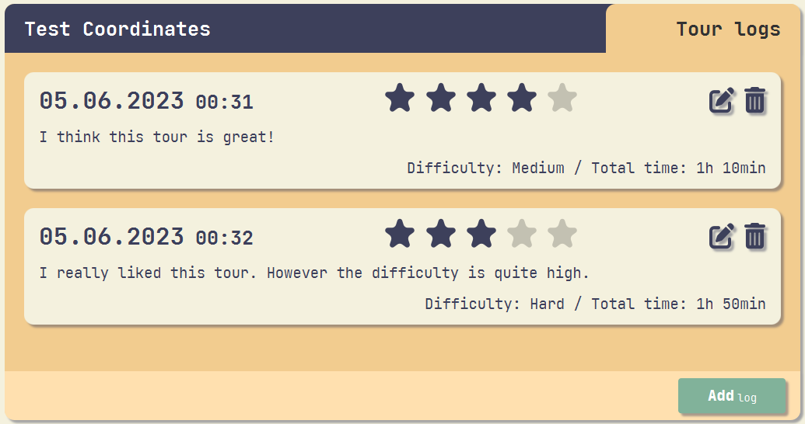
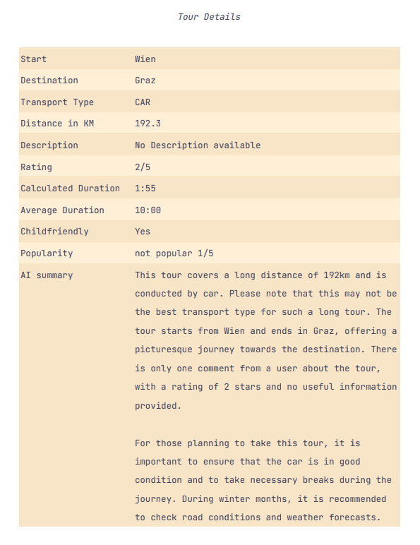

#### Tour Planner - A JavaFX application for planning tours

This app allows users to **create and manage tours**. It features a **UI built with JavaFX** and the **MVVM architecture**.
Routes are calculated using the **MapQuest API** and persistence is managed with **Hibernate** and the **JPA**.
**itext7** is used to generate PDF reports. Tours can be imported and exported as JSON files using **Jackson**.

> ### Notice
> The real world applications of this project are very limited.
> It was created as a university project to learn about the technologies used. Please view this as more of a
> showcase on how UIs can be designed in JavaFX.

## Table of Contents
- [Features](#features)
- [Dependencies](#dependencies)
- [Setup](#setup)
- [Configuration](#configuration)
- [Screenshots](#screenshots)
- [Design decisions and architecture](#comments-on-design-decisions-and-architecture)

## Features
- Create, edit and delete tours
- Live search for tours by name, starting point, destination or distance
- Add, edit and delete tour logs
- See statistics about tours
- See route information calculated by the MapQuest API
- See map image obtained from the MapQuest API
- Generate PDF reports
- Export tours as JSON files
- Import  tours from JSON files

## Dependencies
- JavaFX
- Hibernate
- JPA
- itext7
- Jackson
- MapQuest API
- JUnit
- Mockito
- Log4j
- Lombok

## Setup
1. Clone the repository
2. Rename `template_config.properties` to `config.properties`
3. Get a [MapQuest API key](https://developer.mapquest.com/documentation/) and add it to `config.properties`
4. Create a postgres database and add the connection information to `config.properties`
(there is no need to create any tables as hibernate does this automatically at startup)
5. Start the application

## Configuration
The application can be configured by editing the `config.properties` file.

DB configuration:
- `db.url` - The url of the database
- `db.user` - The username for the database
- `db.password` - The password for the database
- `db.driver` - The driver for the database (set to `org.postgresql.Driver` by default)

MapQuest API configuration:
- `mapApi.routeCalculationEndpoint` - The endpoint for the route calculation API (default is mapQuest directions v2 optimized route API)
- `mapApi.imageEndpoint` - The endpoint for the map image API (default is mapQuest static map v5 API)
- `mapApi.key` - The API key for the MapQuest API

Tour export configuration:
- `tourExport.fileExtension` - The file extension for exported tours (default is `.json`)

Logging:
- `logging.level` - The logging level (default is `INFO`)

## Screenshots
*Tourplanner with no tours*  
  

*Tourplanner with tours*  
  

*Responsive UI*  
  

*Edit tour*  
  

*Tour logs*  
  

*Edit tour logs*  
  

*Delete confirmation*  
  

*Export tours*  
  

*Advanced search*  
  

*Tour in PDF report*  
 

*Tour-details in PDF report*  
  

*Tour-logs in PDF report*  

## Comments on design decisions and architecture
### User Interface (JavaFX)
The project is based on the MVVM architecture. The UI is split into distinct views (e.g. search-box, tours-list, tour.info, etc.).
Each view has its own controller (called ViewModel in MVVM) that is responsible for data-binding the view elements to the model.
The different views are then combined in a main-view. Splitting the project up into views makes it more modular and easier to work on as a team.
It also avoids huge fxml files and controllers.

The model is shared across all controllers and is in the TourLogic object. This object has 3 important Fields:
- `allTours`: This observableList contains all tours
- `searchedTours`: This filteredList only contains tours that match the current search criteria
- `selectedTourProperty`: This is the currently selected tour (null if no tour is selected)

The different views then simply bind to these fields in the TourLogic.
This shared model is advantageous because the controllers never have to actually talk to each other, they simply modify the model and the changes are reflected in all other views.
For example:
- The controller of the searchBox wants to change the currently visible tours so that only the tours matching the current search criteria are displayed. Instead of talking to the tour-list controller directly, the search-box controller updates the searchedTours list. This change is then automatically reflected by the tour-list because of data binding.
- The user clicks on a tour in the tour-list. Instead of talking to the map controller and tour-info controller directly, the tour-list controller simply updates the tour in the selectedTourProperty. This tour is then immediately displayed by the map-controller, tour-info controller and tour-logs controller because they always display the tour that is currently in the selectedTourProperty.

### Business Logic
The business logic is also in the TourLogic object.
This object provides the controllers with functions like `createNewTour()` and `saveSelectedTour()`.
It also talks to the repository for persistence and uses several services for calculating different tour values.

### Repository
The repository uses hibernate to persist and update the tour objects.
It uses the Jakarta Persistence API so the OR-mapper can be changed from hibernate to something else easily.

### Persistence
The Tour and TourLog models have JPA annotations so that they can be persisted correctly.
However, getters and setters are used for persistence because the actual fields are properties (for data-binding) which cannot be saved to the database directly.

### Design pattern
Dependency injection is used to make classes exchangeable for other implementations of the same interface.
For example, the TourLogic can use any IFileImportExportService and any ITourMapService.
This enables the implementation of these services to be exchanged for an entirely different one (e.g. Google Maps instead of MapQuest) without having to change any other code.
The dependency injections are done in the ControllerFactory that gives all the Controllers and the TourLogic the concrete implementations of the services.
